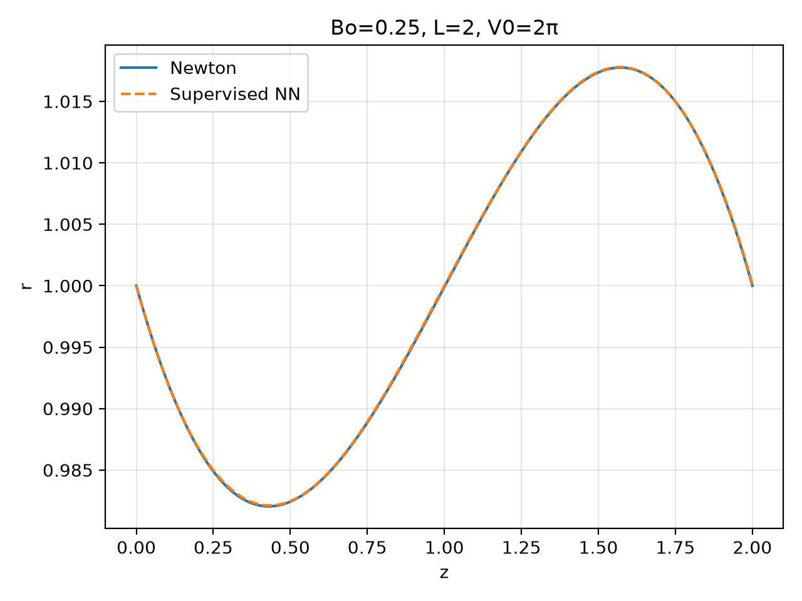
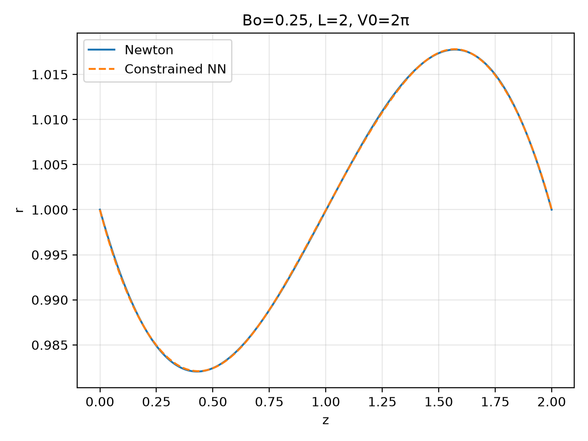

# Young–Laplace Supervised ML

A supervised neural surrogate for predicting axisymmetric liquid-bridge equilibrium solution governed by the Young–Laplace equation.

A Fortran finite-element Newton solver generates reference solutions. A PyTorch model learns the bridge geometry and reference pressure across Bond numbers, then evaluates predictions at held-out Bond numbers.

## Overview

The workflow consists of three stages:

1. Generate numerical reference solutions with the Fortran solver.
2. Train the neural surrogate on selected Bond numbers.
3. Compare predictions with reference solutions at unseen Bond numbers.

The baseline uses solution data only. The constrained variant adds boundary-condition and volume-conservation penalties.
Neither method includes a governing-equation residual in its loss.

## Physical problem

The bridge has fixed contact lines, unit end radii, and dimensionless length $L=2$:

$$
r(0)=r(L)=1.
$$

Its prescribed volume is

$$
V=\pi\int_0^L r(z)^2 \ dz=2\pi.
$$

With dimensionless surface tension equal to one, the Young–Laplace equation for a profile representable as $r(z)$ is

$$
\frac{1}{r\sqrt{1+r_z^2}} - \frac{r_{zz}}{(1+r_z^2)^{3/2}} = P_0+\mathrm{Bo}\ z.
$$

The Fortran implementation uses a parametric representation of the interface and solves for its coordinates and the unknown pressure $P_0$.

## Neural surrogate

The model contains two tanh networks:

- **Geometry network:** computational coordinate $t\in[0,1]$ and Bond number → radial and axial corrections.
- **Pressure network:** Bond number → reference pressure.

The outputs are constructed as

$$
r(t,\mathrm{Bo})=\exp(N_r(t,\mathrm{Bo})),
$$

$$
z(t,\mathrm{Bo})=2t+N_z(t,\mathrm{Bo}),
$$

$$
P_0(\mathrm{Bo})=1-\mathrm{Bo}+N_p(\mathrm{Bo}).
$$

The exponential representation enforces positive radius. Boundary conditions and volume conservation are learned from the reference data rather than imposed exactly by this network architecture.

### Training objective

For the solution vector

$$
\mathbf{U}=(r_1,z_1,\ldots,r_N,z_N,P_0),
$$

the supervised loss is

$$
\mathcal{L} = \frac{1}{N_B} \sum_{b=1}^{N_B} \frac{1}{2} \left\| \mathbf{U}_{\theta,b} - \mathbf{U}_{\mathrm{Newton},b} \right\|_2^2.
$$

Training uses float64 arithmetic, Adam optimization, and scaled L-BFGS refinement. The best recorded model is retained.

The loss is averaged over training Bond numbers and summed over solution components.

## Installation

Requirements:

- Python with PyTorch, NumPy, and Matplotlib
- GNU Fortran (`gfortran`)
- GNU Make

Clone the repository:

```bash
git clone https://github.com/HansolWee/young-laplace-supervised-ml.git
cd young-laplace-supervised-ml
```

Install Python dependencies:

```bash
python -m pip install torch numpy matplotlib
```

Build the Fortran executables:

```bash
make
```

This builds:

- `yl`: Newton reference solver
- `yl_evaluate`: residual and gradient evaluator

The supervised training script uses `yl`.

## Usage

### Train with default settings

```bash
python train_yl_supervised.py --output yl_supervised
```

By default, the script uses:

- 10 training Bond numbers evenly spaced from 0.1 to 2.8
- 9 test Bond numbers evenly spaced from 0.25 to 2.65
- Up to 5,000 Adam updates
- Up to 200 outer L-BFGS steps
- An unscaled data-loss target of `1e-10`
- Random seed 7

Each outer L-BFGS step may perform multiple internal iterations and loss evaluations. Optimization may stop early when the loss target is reached.

Use a new or empty output directory for each run.

### Choose training and test cases

```bash
python train_yl_supervised.py \
    --train-bonds 0.1 0.4 0.7 1.0 1.3 1.6 1.9 2.2 2.5 2.8 \
    --test-bonds 0.25 0.55 0.85 1.15 1.45 1.75 2.05 2.35 2.65 \
    --output results_custom
```

Training and test Bond numbers must be distinct and lie within the configured normalization interval.

List all options:

```bash
python train_yl_supervised.py --help
```

### Run the reference solver alone

```bash
./yl 100 0.1
```

The arguments specify the number of finite elements and the Bond number. The solver writes `u_newton.dat` in the current directory.

## Outputs

The training script saves:

| File | Contents |
|---|---|
| `config.json` | Run settings and model metadata |
| `model.pt` | Selected model weights and metadata |
| `history.csv` | Recorded optimization history |
| `history.png` | Supervised loss plot |
| `train_metrics.csv` | Errors on training cases |
| `test_metrics.csv` | Errors on held-out cases |
| `test_max_errors.json` | Maximum errors across test cases |
| `test_error_vs_bond.png` | Relative solution-vector error versus Bond number |

Per-case directories under `train/` and `test/` contain reference solutions, predictions, comparison figures, metrics, and Tecplot output.

Figures are saved automatically without requiring an interactive display.

## Validation and scope

Evaluation reports relative errors in the solution vector and coordinate fields, together with absolute and relative pressure errors.

The default test cases measure interpolation within the training Bond-number range. They do not establish extrapolation performance.

The reference solutions are numerical finite-element solutions. Agreement with them measures surrogate accuracy relative to that discretization.

The reported training tolerance applies to supervised data loss, not to the Young–Laplace residual.

## Coordinate and pressure conventions

This solver uses the pressure term

$$
P_0+\mathrm{Bo}\ z.
$$

The companion small-Bond-number perturbation PINN uses a pressure term of the form $K-Gz$.

For the same domain length and $G=\mathrm{Bo}$, these conventions are related by

$$
z_{\mathrm{PINN}}=L-z_{\mathrm{Fortran}},
\qquad
K=P_0+GL.
$$

Comparisons therefore require matching domain lengths, reversing the axial coordinate, and shifting the reference pressure.

The perturbation solution retains terms only through first order in the Bond number, whereas the Fortran solver solves the nonlinear problem.

## Source files

| File | Purpose |
|---|---|
| `train_yl_supervised.py` | Data generation, training, and evaluation |
| `mod_yl.f90` | Finite-element assembly and Newton solver |
| `mod_yl_benchmark.f90` | Problem setup and initial geometry |
| `main_yl.f90` | Reference-solver command-line program |
| `mod_yl_python.f90` | Residual and gradient evaluation |
| `main_yl_evaluate.f90` | Evaluator command-line program |
| `Makefile` | Fortran build rules |

## Physics-constrained supervised learning

`train_yl_constrained.py` extends the supervised surrogate with soft penalties for fixed contact-line boundary conditions and volume conservation.

Both training methods share the same neural architecture and Fortran-generated reference data.

| Method | Script | Training objective |
|---|---|---|
| Supervised | `train_yl_supervised.py` | Data loss |
| Physics-constrained supervised | `train_yl_constrained.py` | Data loss + boundary and volume penalties |

### Objective

$$
\mathcal{L}_{\mathrm{total}} = \mathcal{L}_{\mathrm{data}} + \lambda_{\mathrm{BC}}\mathcal{L}_{\mathrm{BC}} + \lambda_V\mathcal{L}_V.
$$

For each training Bond number, the boundary residual is

$$
\mathbf{c} = \left(r(0)-1,\ z(0),\ r(1)-1,\ z(1)-2\right),
$$

where the arguments denote the computational coordinate $t\in[0,1]$.

The constraint losses are

$$
\mathcal{L}_{\mathrm{BC}} = \frac{1}{2N_B}\sum_{b=1}^{N_B}\|\mathbf{c}_b\|_2^2,
$$

$$
\mathcal{L}_V = \frac{1}{2N_B}\sum_{b=1}^{N_B}(V_b-2\pi)^2.
$$

Volume is evaluated using the same quadratic-element interpolation and three-point Gauss quadrature as the Fortran implementation. This computation is differentiable in PyTorch.

Both penalty weights default to **1.0**.

### Run

Build the Fortran solver and run constrained training:

```bash
make
python train_yl_constrained.py \
    --lambda-bc 1.0 \
    --lambda-volume 1.0 \
    --output yl_constrained
```

Use a new or empty output directory for each run.

List all available settings:

```bash
python train_yl_constrained.py --help
```

Training uses Adam followed by scaled L-BFGS refinement. The best recorded model is selected using the total objective.

For this script, `--tol` specifies the unscaled total-loss target.

### Evaluation

In addition to prediction errors against Newton solutions, the script reports boundary and volume errors for both the neural predictions and the numerical references.

The output includes:

- `history.csv` and `history.png`: total loss and individual loss components
- `train_metrics.csv` and `test_metrics.csv`: prediction and constraint errors
- `test_max_errors.json`: maximum selected test errors
- `test_error_vs_bond.png`: relative solution-vector error across test cases
- Per-case solution comparisons and Tecplot files
- `config.json` and `model.pt`: configuration and selected model

### Interpretation

The boundary and volume constraints are soft training penalties. They are evaluated only at training Bond numbers and are not enforced exactly at inference.

No Young–Laplace PDE residual is included in the objective, and no correction or projection is applied to predictions after inference.

Newton reference solutions are generated before training. The optimization loop runs entirely in PyTorch.

To compare the two methods, use matching training/test Bond numbers, mesh resolution, network architecture, and optimization settings. Report prediction errors together with boundary and volume errors on held-out cases.

## Comparison at an unseen Bond number

The two models are evaluated at **Bo = 0.25**, which is excluded
from both training datasets. Each prediction is compared with
the Fortran Newton reference solution.

Both runs use the same training/test Bond numbers, mesh resolution,
and network architecture.

| Supervised learning | Physics-constrained supervised learning |
|:---:|:---:|
|  |  |
| Data loss | Data loss + boundary and volume penalties |

The boundary and volume penalties are applied only at training
Bond numbers. This comparison evaluates how well the learned
solution and constraints generalize to an unseen Bond number.

## Comparison across unseen Bond numbers

Lower errors are better. S: supervised; C: physics-constrained.

| Bo | Radius error S | Radius error C | Pressure error S | Pressure error C |
|---:|---:|---:|---:|---:|
| 0.25 | 6.5200e-05 | 7.0573e-05 | 7.5745e-05 | 1.2542e-04 |
| 0.55 | 4.0765e-05 | 3.6919e-05 | 1.0374e-04 | 2.8521e-04 |
| 0.85 | 5.9898e-05 | 4.9406e-05 | 1.4725e-04 | 3.4873e-04 |
| 1.15 | 3.4457e-05 | 5.1472e-05 | 7.1570e-05 | 1.5761e-05 |
| 1.45 | 6.1627e-05 | 5.3956e-05 | 2.5649e-04 | 3.0766e-04 |
| 1.75 | 6.9520e-05 | 5.4565e-05 | 1.1392e-05 | 1.4199e-04 |
| 2.05 | 7.8103e-05 | 7.8194e-05 | 4.5758e-04 | 3.2458e-04 |
| 2.35 | 1.3418e-04 | 1.3772e-04 | 9.0787e-05 | 2.4633e-05 |
| 2.65 | 7.1384e-04 | 6.5847e-04 | 1.4387e-03 | 1.3473e-03 |

Radius errors are relative L2 errors; pressure errors are absolute.

### Summary over test Bond numbers

| Metric | Supervised mean | Constrained mean | Supervised max | Constrained max |
|---|---:|---:|---:|---:|
| Relative solution-vector error | 1.1005e-04 | 1.1288e-04 | 5.3319e-04 | 5.3051e-04 |
| Relative radius error | 1.3973e-04 | 1.3236e-04 | 7.1384e-04 | 6.5847e-04 |
| Relative axial-coordinate error | 7.7358e-05 | 9.2228e-05 | 3.3670e-04 | 4.0673e-04 |
| Absolute pressure error | 2.9481e-04 | 3.2459e-04 | 1.4387e-03 | 1.3473e-03 |
| Maximum absolute boundary error | 2.6617e-04 | 2.8935e-04 | 7.4743e-04 | 1.2880e-03 |
| Absolute volume error | 1.0500e-03 | 4.4858e-04 | 3.2622e-03 | 1.4434e-03 |
